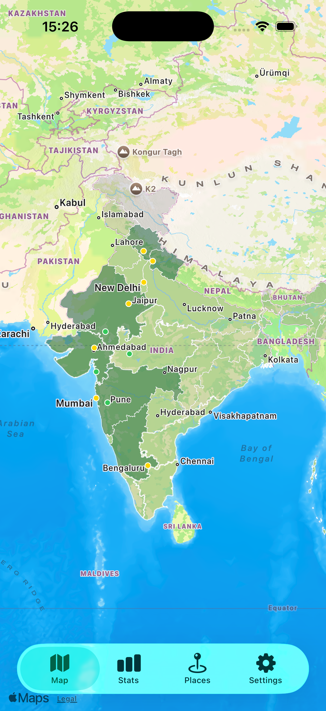
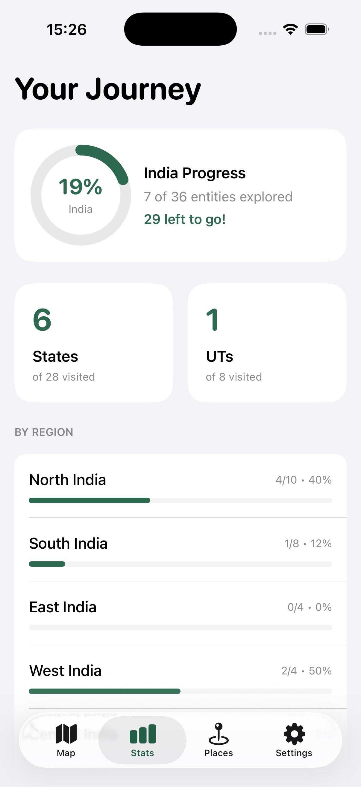
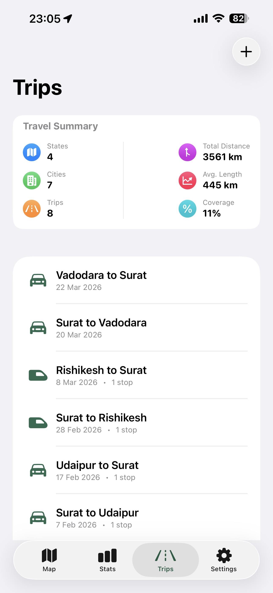
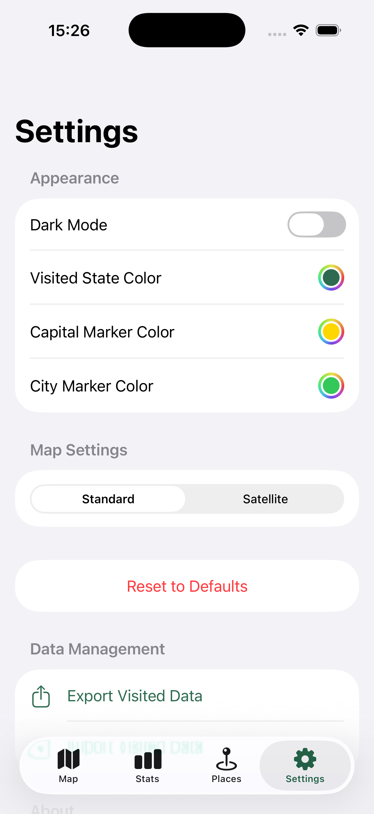

# BeenThere

*Vibe coded with Gemini*

BeenThere is a native iOS application designed to help you track your travels across India. It provides an interactive map where you can mark visited states and union territories, and view detailed statistics about your regional coverage.

## Screenshots

<p align="center">
  
  
  
  
</p>

## Features

- **Interactive India Map:** Tap on states and union territories to explore and mark cities as visited.
- **City-Level Tracking:** Track individual cities within each state. Distinguish between capital cities and regular visited cities.
- **Road Trip Tracking:** Record detailed trips between cities with support for multiple intermediate stops and various transport modes (Plane, Train, Car, Bike).
- **Travel Dashboard:** A dedicated Trips tab with a visual summary card showing total states, cities, distance, and trip statistics.
- **Detailed Analytics:** Drill down into your travel summary to see exactly which states and cities you've visited through your trips.
- **Customizable Appearance:** Personalize your map with custom colors for visited states, capital markers, and regular city markers. Supports both Standard and Satellite map styles.
- **Dark Mode Support:** A fully adaptive UI that looks great in both light and dark appearances.
- **Dynamic Stats:** Track your progress with percentage-based coverage for different regions of India, with specific breakdowns for States and Union Territories.
- **Data Portability:** Export your travel history as a JSON file or import a previous backup to stay synced across devices.
- **Persistence:** All data is saved securely on-device using `UserDefaults`.

## Tech Stack

- **Swift & SwiftUI:** Modern declarative UI.
- **MapKit:** High-performance mapping and GeoJSON rendering.
- **XcodeGen:** Simplified project management and configuration.
- **MVVM Architecture:** Clean separation of concerns for maintainability and testability.

## Project Structure

```text
├── BeenThere/          # Main application code
│   ├── App/            # App entry point and lifecycle
│   ├── Resources/      # Assets, GeoJSON map data, and city data
│   └── UI/             # SwiftUI Views, ViewModels, and UI helpers
├── BeenThereTests/     # Unit tests for business logic and ViewModels
├── screenshots/        # Application screenshots for documentation
├── openspec/           # Specifications and change history (OpenSpec workflow)
├── LICENSE             # MIT License file
└── project.yml         # XcodeGen configuration
```

## Architecture

The project follows the **MVVM (Model-View-ViewModel)** pattern:

- **StateVisitManager:** Handles state-level visited status, derived from city visits.
- **CityVisitManager:** The central source of truth for individual city visits and persistence.
- **StatsViewModel:** Computes statistics, regional coverage, and progress percentages.
- **IndiaMapView:** A `UIViewRepresentable` wrapper for `MKMapView` that handles GeoJSON rendering, custom markers, and tap interactions.
- **StatsView:** Displays visual representations of travel progress.
- **SettingsView:** Provides controls for appearance, map style, and data management.

## Getting Started

### Prerequisites

- macOS with Xcode 15 or later.
- [XcodeGen](https://github.com/yonaskolb/XcodeGen) (can be installed via Homebrew: `brew install xcodegen`).

### Setup

1. Clone the repository.
2. Generate the Xcode project:
   ```bash
   xcodegen generate
   ```
3. Open `BeenThere.xcodeproj` in Xcode.
4. Select a simulator or physical device (iOS 16.0+) and run the app (Cmd+R).

## Development Workflow

This project uses **OpenSpec** for spec-driven development. 

- New features or major changes are first proposed in the `openspec/` directory.
- Use the Gemini CLI commands (if available) to manage the workflow:
    - `/opsx:propose` - Start a new change.
    - `/opsx:apply` - Implement tasks.
    - `/opsx:archive` - Finalize changes.

## Testing

Run unit tests via Xcode (Cmd+U) or using `xcodebuild`:
```bash
xcodebuild test -scheme BeenThere -destination 'platform=iOS Simulator,name=iPhone 15'
```

## Data Sources

The map boundaries are provided by `india_states.geojson` located in the `Resources` directory. This data is used by `IndiaMapView` to render state polygons on the `MKMapView`.

## License

This project is licensed under the MIT License.
